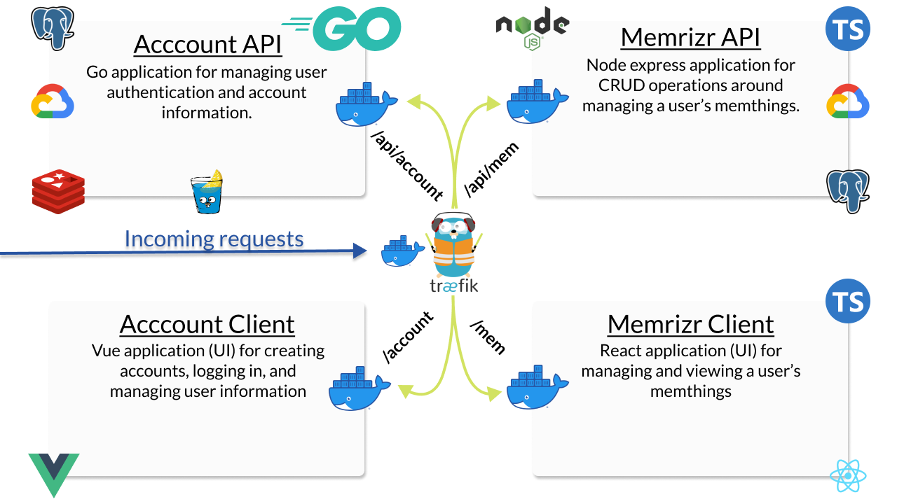

# Memrizr

This is the repository for the Memrizr memorization application tutorial which is a work in progress. If you're interested in the tutorial, check out the videos on [YouTube](https://www.youtube.com/playlist?list=PLnrGn4P6C4P6yasdEJnEUhueTjCGXGuFe)!

You can find my written tutorials on my [dev.to feed](https://dev.to/jacobsngoodwin).

A chart of the tools and applications used in this tutorial is given below.

To run this code, you will need docker and docker-compose installed on your machine. In the project root, run `docker-compose up`.

Furthermore, Traefik will handle HTTP routes with HOST `malcorp.test`. So you will need to add the following to your hosts file to map this domain name to localhost.

`127.0.0.1       malcorp.test`

The hosts file can be found (to the best of my knowledge) at `~/etc/hosts` on Mac/Linux or `C:\Windows\System32\drivers\etc` on Windows. 

I also recommended that you use the development tool of your choice with any desired tools for go, react, vue, and node, and typescript configured.

Cheers, eh!
